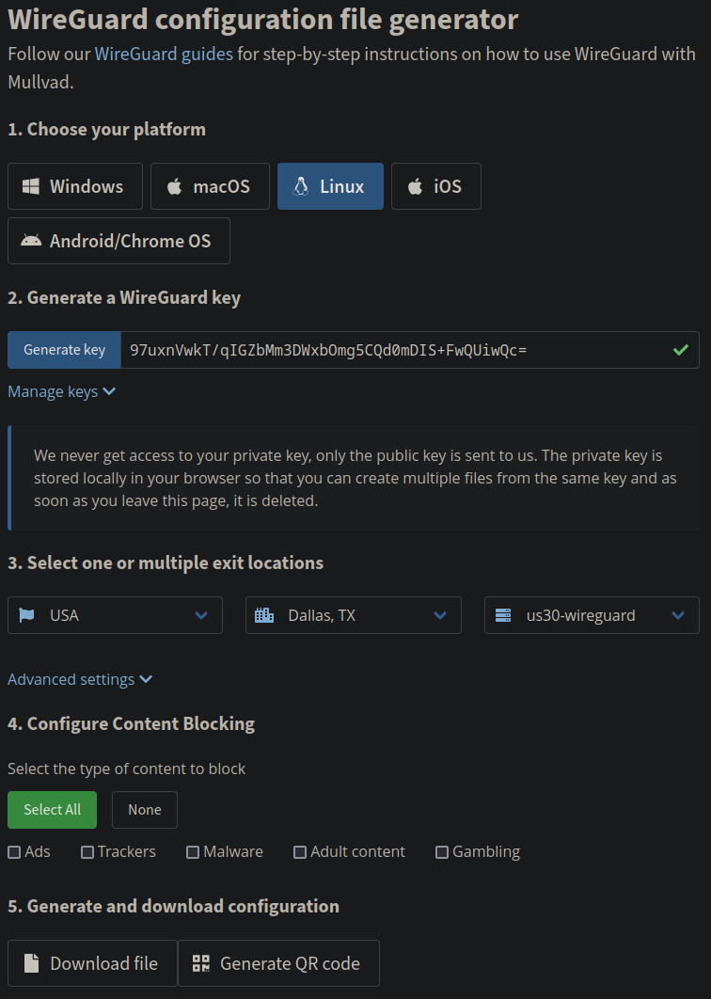
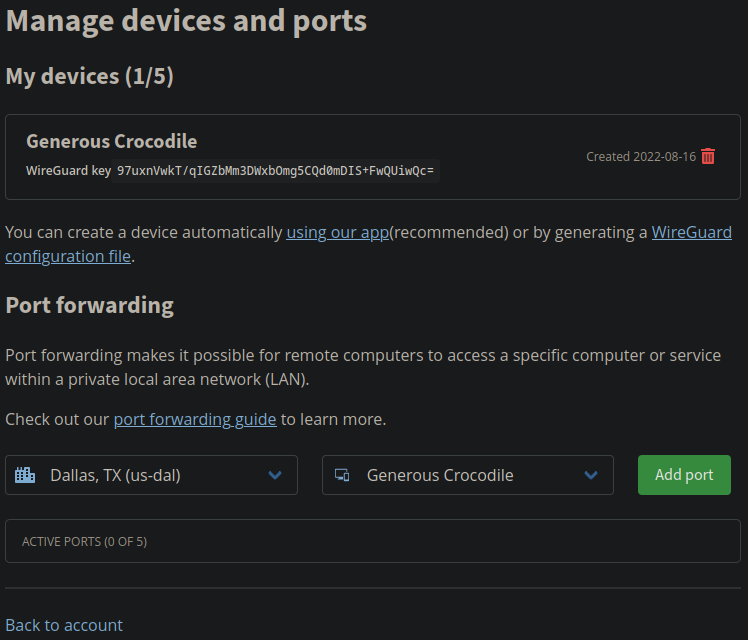
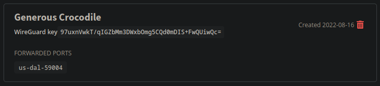
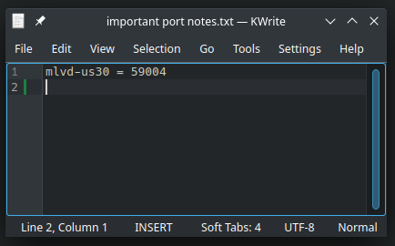
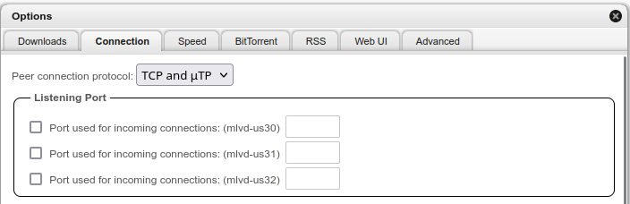
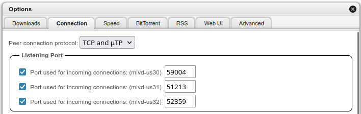

# qBitMF (qBittorrent-MultiFace)
qBitMF is a docker container that runs qBittorrent over multiple VPN (or other) interfaces simultaneously. This is an example of a "multiface" torrent client, multiface being a portmanteau of "multiple" and "interface".

qBitMF is a proof of concept, and as such, these things need to be kept in mind:
- This docker container only supports WireGuard interfaces.
- I've only tested this with the Mullvad VPN provider, however it should work with other providers as well.
- PRs for improvements are always welcome, but otherwise this likely won't be maintained much.

On the other hand, the usage of this container should still be simple:
- WireGuard configs added to the `interfaces` directory will be automatically set up and configured.
- qBittorrent cannot leak outside of the VPNs configured, thanks to Linux network namespaces. This includes DNS. (In fact, qBittorrent doesn't even have a way to get the internal docker container IP address, let alone that of the host. It only sees the configured wireguard interfaces and localhost.)

# How to use qBitMF

This uses Mullvad as an example of how to use qBitMF, but any other provider that gives wireguard configs should work as well.

## Generating WireGuard config files
First, grab your WireGuard configuration files from Mullvad.

Once logged in, go to https://mullvad.net/en/account/#/wireguard-config and click "Generate key".

Then, select your Country, City, and Server underneath. **DO NOT** pick "All servers", as this may cause qBitMF to connect to the same VPN server multiple times.

> **Note**
> It's recommended to look at the [Mullvad Servers](https://mullvad.net/en/servers/) page to see the speeds of each server.

Then, once you're happy with what you've picked, click `Download file`.

  

> **Warning**
> Do not use us30-wireguard. Pick a different server, because us30 is bound to get overloaded if everyone picks it.

Once you've clicked `Download file`, you should have a wireguard config file (in my case, called `mlvd-us30.conf`). It should look something like:

```ini
[Interface]
PrivateKey = (snipped)
Address = 10.64.23.144/32,fc00:bbbb:bbbb:bb01::1:178f/128
DNS = 10.64.0.1

[Peer]
PublicKey = RW+wwTv4BqRNbHPZFcIwl74f9kuRQlFLxnaocpMyKgw=
AllowedIPs = 0.0.0.0/0,::0/0
Endpoint = 174.127.113.8:51820
```

Save this file in a directory somewhere.

Next, it's recommended you configure an incoming port. Go to https://mullvad.net/en/account/#/ports. You will see the WireGuard key you generated under "My devices" with a unique name.

Select the city that you generated the configuration file in (in my case, `Dallas, TX`), and select that device name beside it, then click "Add port".

  

Once you've added the port, you will see the port show up under your device:

  

Make a note of this port (in my case, port 59004), and the fact that it's associated with the config file you just downloaded (in my case, `mlvd-us30`).



Now, repeat these steps for each of the VPN interfaces you want to use. Try to also generate listening ports for the other interfaces too, if possible.

> **Note**
> To start out, I'd recommend making 2 or 3 config files.

## Configuring Docker (and docker-compose)
Now that we have a collection of config files, we need to configure docker to use those config files.

Grab this git repo, making sure to include the dependency submodules:

```
git clone --recurse-submodules https://github.com/qBitMF/qBitMF.git
```

This repository contains a `docker-compose.yml` file - using it, or basing your docker-compose file on its contents, is recommended.

> **Note**
> With the default configuration, downloads and configuration files generated by qBittorrent will go into the `./downloads` and `./config` directories, respectively. These paths may be changed.

Now, take those WireGuard `.conf` files, and put them all into `./interfaces`.

Once you've done that, run:

```
docker-compose up -d --build
```

This will build qBittorrent and start up a docker instance of it running at `http://127.0.0.1:8080`.

# Configuring qBittorrent

In a browser, visit http://127.0.0.1:8080 with the username `admin` and the password `adminadmin`.

> **Warning**
> Change these credentials. Using the default username and password is bad, especially if you expose this to the internet.

Next, click Options (the gear at the top of the page), and click on Connection.

  

On this page, we want to set the ports that we collected earlier from Mullvad. Click the checkboxes on the interfaces you have listening ports for, and enter them in.

  

Scroll down, hit Save, and you're done!

Now you can use qBittorrent as you normally would, but running over multiple interfaces! 

# License

The docker-compose, Dockerfile, and all script components are licensed under the [Universal Permissive License 1.0](https://opensource.org/licenses/UPL). This is similar to dual-licensing code as MIT and Apache2.

[qBittorrent](https://github.com/qbittorrent/qBittorrent) is copyrighted by the [qBittorrent authors](https://github.com/qbittorrent/qBittorrent/blob/master/AUTHORS) and is licensed under the GPLv2 or later. [All qBitMF modifications](https://github.com/qbittorrent/qBittorrent/compare/master...qBitMF:qBittorrent-multiface:master) made to qBittorrent are licensed under the Universal Permissive License 1.0.

[libtorrent](https://github.com/arvidn/libtorrent) is copyrighted by the [libtorrent authors](https://github.com/arvidn/libtorrent/blob/RC_2_0/AUTHORS) and is licensed under the BSD 3-clause license. [All qBitMF modifications](https://github.com/arvidn/libtorrent/compare/RC_2_0...qBitMF:libtorrent-multiface:RC_2_0) made to libtorrent are licensed under the Universal Permissive License 1.0.